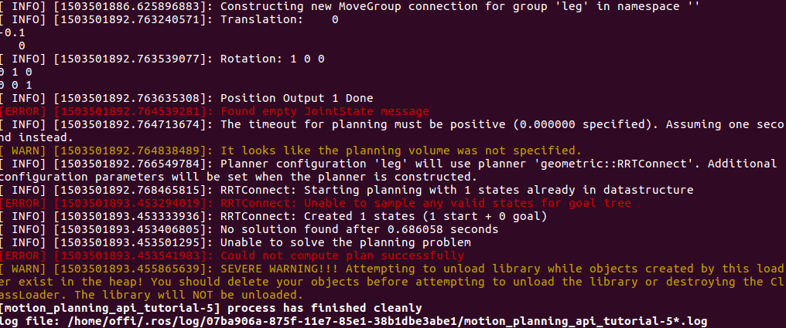
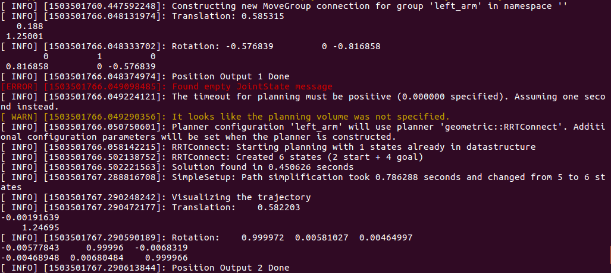

**Source:** [Experimental Code](https://github.com/poeffie/roboy_ik_additional_files)

# Testing The Code
For planning IK it is necessary to make position request, that are reachable. Especially if your robot has a complex kinematics, it is not recommended to simply guess any position and test them until one of them is reachable. This is the reason why I also wrote another piece of code, that combines the existing Publisher node with some forward kinematics lines. The code can be found [here](https://github.com/poeffie/roboy_ik_additional_files). You can use it by simply overwriting the `motion.cpp` or by adding it as an additional node to the package. As the experimental code is pretty long and repeats several lines, that were already discussed in the publisher chapter, I will give here just a short explanation of what code does. There are furthermore some comments, that should help understanding the details. For further information about forward kinematics visit the [ official MoveIt! Kinematic Model tutorial](http://docs.ros.org/kinetic/api/moveit_tutorials/html/doc/pr2_tutorials/kinematics/src/doc/kinematic_model_tutorial.html).

What the experimental basically does, is calculating forward kinematics first for some hardcoded joint angles. You can change them easily to try out other positions. This forward kinematics will be visualized in Rviz and looped for several seconds. I save the final position of the end effector and print it with ROS_INFO. 

In the next step IK will be executed. You can set the position to reach accordingly to the coordinates, that were calculated by the forward kinematics. The IK should now theoretically reach that position and output another trajectory, that is not identical wit the forward kinematics one. The position of the end effector will be printed here as well. Setting the tolerances may lead to pretty varying results.

# Issues
Actually there is an issue, that could not be fixed yet. The IK part will most likely put out an error warning, that no solution could be found. Most likely, because sometimes it works for some reasons, even without changing any parameters / lines of code. Following figure shows the typical error. The image below shows how it looked like, when IK worked.

Error message

Working IK
