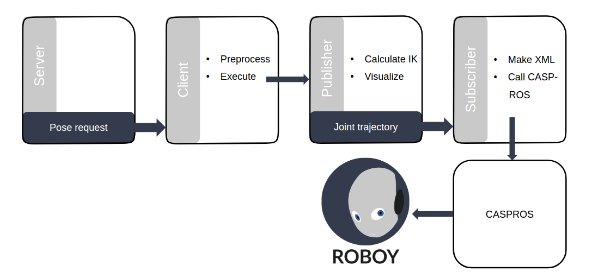

# Setup
The code for inverse kinematics is written in a ROS package. This can be downloaded by executing following steps:

1. open your terminal in your ROS workspace folder, e.g. `catkin_ws/src`
2. `git clone https://github.com/poeffie/roboy_ik`
3. `cd ~/catkin_ws`
4. `catkin_make`
5. `source ~/catkin_ws/devel/setup.bash`

# System Architecture
The architecture of the implementation is depicted in the following figure.

Basically we call the inverse kinematics with a ROS service request. The client makes some preprocessing, which includes status checking, wheater Roboy allows movements at the moment or not. This is still subject of implementation. If a IK movement is possible, the publisher node will be called, that does the actual inverse kinematics calculations and outputs the joint trajectory. Visualizing the movement is optional. In this case it is enabled, so one can investigate the movements of Roboy in RViz. In addition to the publisher, the client also activates the subscriber node, that subscribes to the joint trajectory topic. The received message will afterwards be converted into a .xml file, that is readable by CASPR and CASPROS for simulating / generating motor commands.

In the following chapters we will go through each of the three main programs, the service node, the publisher as well as the subscriber.

