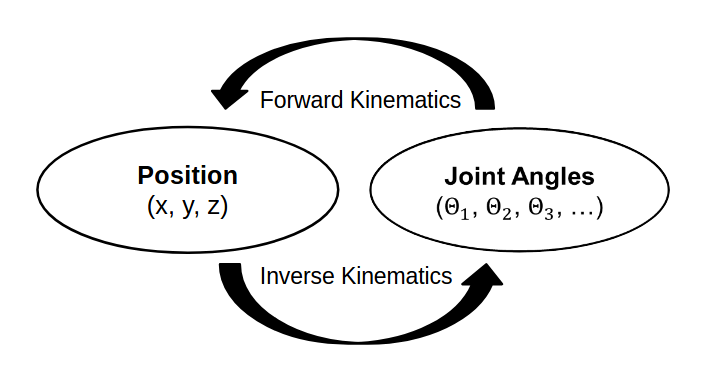
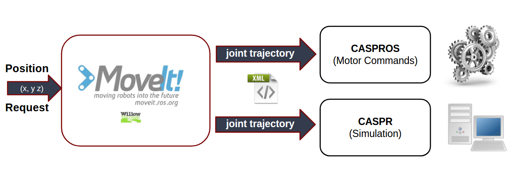

# Roboy 2.0 - Inverse Kinematics

For an advanced interaction of Roboy with the environment it is useful to move parts of the body to desired positions. Such body parts could be arms, legs, shoulder, head, etc. This would open up lots of new possibilities, like grabbing small objects with Roboy's hands, moving the legs (PaBiLegs) to desired positions or looking around.

## Goal
Roboy 2.0 should therefore have the possibility to be controlled in a way, that desired positions in space can be reached. This kind of control is called inverse kinematics (IK).
Inverse kinematics in general means calculating joint angles of the robot for a given position in space.
The opposite of IK is called forward kinematics, which describes computing the position in space by knowing about the values of the joint parameters.

## Difficulties
In contrast to forward kinematics, calculating the inverse kinematics is a difficult task. For a desired position in space there could be infinitely many solutions. As an example, we can think about pressing our hand on a flat table, but still having the possibility to move the ellbow in an angle range. The difficulty is therefore to find an appropriate solution. A further difficculty is, that some of the found solutions may be mathematically correct, but physically not executable. In general there are three ways to solve the IK, numerical, geometrical and algebraical methods. In order not to have to calculate these by hand, there are several tools and solvers freely usable, which we will discuss later. 

But apart from the so far called challenges, Roboy comes with an even increased complexity. Roboy is tendon driven. Instead of direct joint angles, the state of a body part is described by the lengths of the tendons. We therefore need to consider a calulation from joint angles to tendon lengths. This aspect led us overthink the conventional way of computing IK and search for an more appropriate solution.
 
## Approach
In the case of Roboy, the space is three dimensional (x, y, z) and the joint angles describe the motor states of Roboy's body parts. Considering the PaBiLegs the space is just two dimensional, which simplifies the task of calulating the joint angles and could theoretically be calculated manually by hand. But for a general solution for all kinds of body parts we are going to take a 3D IK solver in consideration.

To make inverse kinematics possible, the approach is to do calculate the joint angles of the inverse kinematics with a solver software. For this we are using a common robot motion planning tool, called ROS MoveIt! The additional challenge due to the tendons can be tackled with a software tool called CASPR. In summary, CASPR allows us to simulate and output tendon lengths by a given joint trajectory. Combining these tools and making them accessable via ROS service is our approach for the Roboy 2.0 IK problem. Both tools will be described in detail in the following chapters.
The figure belows depicts the system architecture. We will explain the difference between CASPR and CASPROS more preisely later in the next chapter.

## Sources

A. D'Souza, S. Vijayakumar and S. Schaal, *"Learning inverse kinematics,"* Proceedings 2001 IEEE/RSJ International Conference on Intelligent Robots and Systems. Expanding the Societal Role of Robotics in the the Next Millennium (Cat. No.01CH37180), Maui, HI, 2001, pp. 298-303 vol.1.
doi: 10.1109/IROS.2001.973374

<http://wiki.roblox.com/index.php?title=Inverse_kinematics>

<http://www.diag.uniroma1.it/~deluca/rob1_en/10_InverseKinematics.pdf>

<https://appliedgo.net/roboticarm/>

