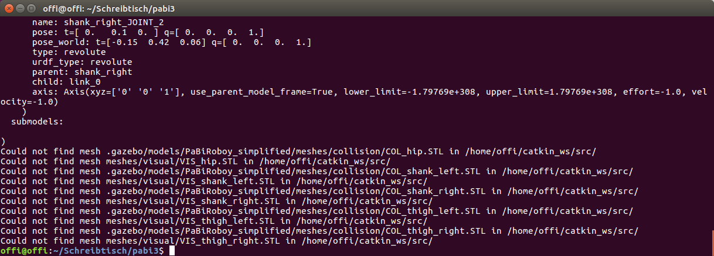

# From SDF to URDF
ROS MoveIt! needs the robot model to be described in URDF. This could be a problem for several robot models, as it is not guaranteed to have your robot already converted into URDF, as it was the case for Roboy. This is why I will explain in this chapter how I converted .sdf files into URDF.

##Install pysdf
First step is to install pysdf. This is a ROS package, that allows easy conversion from sdf to URDF. Go into your catkin_ws folder and execute following commands:

1. `git clone https://github.com/andreasBihlmaier/pysdf`
2. `cd ..`
3. `catkin_make`
4. `source ~/catkin_ws/devel/setup.bash`

##Execute pysdf
1. This step is optional, but I recommend to backup your robot's .sdf files.
2. Now go into your robot model folder and open a terminal there.
3. Execute `rosrun pysdf sdf2urdf.py model.sdf model.urdf`, where model.sdf should be the sdf name of your robot. Typically there is also a `model.config` in the same directory. The output of the command would be in this case `model.urdf`, but you can also give it another name.
4. OPTIONAL: If you want to use pysdf without ROS, you can also open the scripts directory of the package. Copy your `model.sdf` and `model.config` there and execute: `python sdf2urdf.py model.sdf model.urdf`
5. You will most likely get the warning message `Could not find mesh ...`, no matter what method you used. This is completely normal if you are using meshes in your model.

The Error could look like this.
6. What I did now to solve this issue is that I saved my meshes folder in a package that is known by ROS, e.g. `pabi_ik` or the pysdf package, as I did it in my implementation for instance. Just copy your meshes there and edit the path to these meshes in the generated URDF file accordingly.
7. Last step, but a very important one, is to check your URDF file and edit false values. ROS MoveIt! won't work with your URDF if it contains values that are extremely high. I often figured out, that some values were set to `1.79769e+308`. I most likely find them in the line `<limit effort="-1.0" lower="-1.79769e+308" upper="1.79769e+308" velocity="-1.0"/>` Change them to 0 for instance. I also changed effort and velocity to 0.0 to make my URDF models work.

#MoveIt! Config
To get familiar with the ROS MoveIt! model configuration I want to refer to the offical [MoveIt! setup_assisant_tutorial](http://docs.ros.org/kinetic/api/moveit_tutorials/html/doc/setup_assistant/setup_assistant_tutorial.html)

